# Demo Project of UI tests for <a target="_blank" href="https://demowebshop.tricentis.com/">Demo Web Shop</a> site

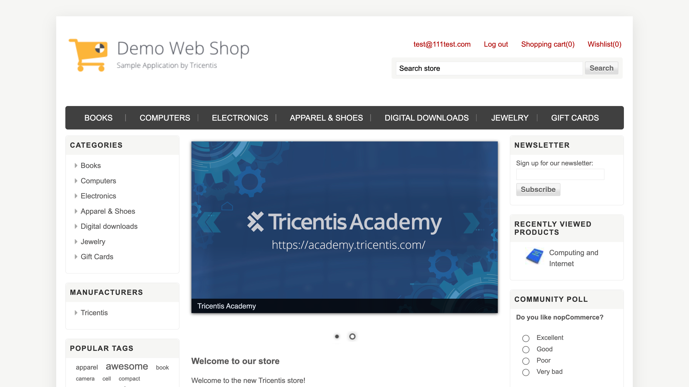

### Tech Stack:
<code></code>
<code></code>
<code></code>
<code></code>
<code></code>
<code></code>
<code></code>
<code></code>
<code></code>
<code></code>
<code></code>
<code></code>
<code></code>

### Test cases:
- Registration:
  - User successfully registers
  - User is unable to register while already being registered
- Login:
  - User successfully logs in
  - User cannot log in without being registered
  - User cannot log in with invalid password
- Search:
  - Search returns results for a valid query
  - Search doesn't return results for a invalid query
- Placing an order:
  - Newly registered user without saved billing address successfully places an order
  - Already registered user with a saved billing address successfully places an order

### For local launch:

1. Create a new directory on your local machine

```bash
mkdir demo_web_shop_diploma
cd demo_web_shop_diploma
```

2. Clone the repository

```bash
git clone https://github.com/AngPawl/demo_web_shop_diploma
```

3. Create and fill in `.env` file based on env.example in the root project directory

4. Install and activate virtual environment

```bash
python -m venv .venv
```
  - For Linux/macOs:
  ```bash
  source .venv/bin/activate
  ```
  - For Windows:
  ```bash
  source venv/scripts/activate
  ```

5. Install requirements from requirements.txt

```bash
pip install -r requirements.txt
```

6. Launch tests from command line

```bash
pytest .
```

## Remote run is executed on <a target="_blank" href="https://selenoid.autotests.cloud/#/">Selenoid</a> server via <a target="_blank" href="https://jenkins.autotests.cloud/job/007-ang_pawl-demo_web_shop_diploma/">Jenkins</a> job

### For remote launch:
- Open <a target="_blank" href="https://jenkins.autotests.cloud/job/007-ang_pawl-demo_web_shop_diploma/">Jenkins</a> job
- Click on Build with Parameters button
- Choose parameters and click on Build

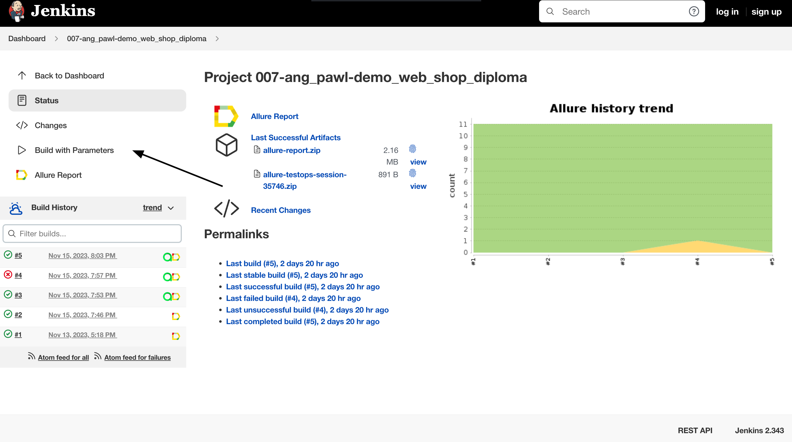
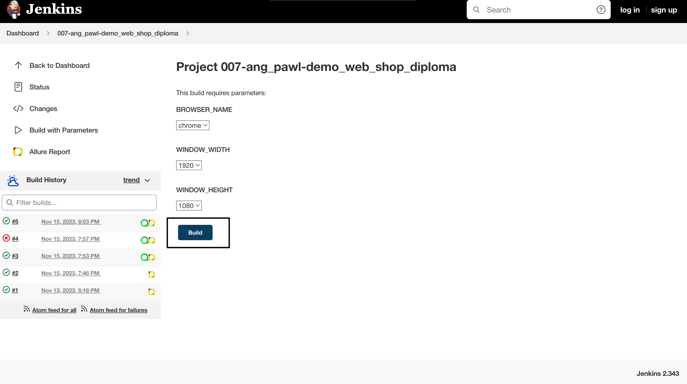

### You may set the following parameters:
- BROWSER_NAME (tests will run in this specific browser): chrome, firefox
- WINDOW_WIDTH (window width resolution): 1920, 1366
- WINDOW_HEIGHT (window height resolution): 1080, 768

### *After the test run is completed you may check result info and related graphics on Allure Report page:*

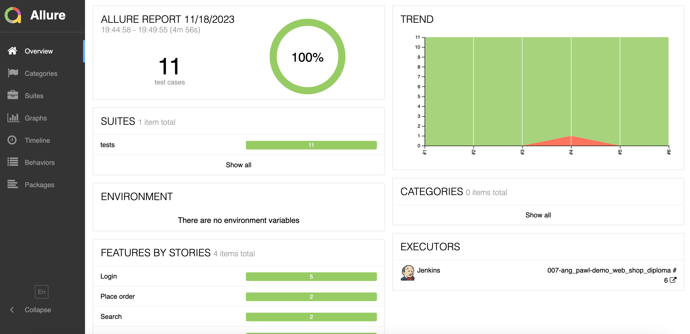

### *You may also look through detailed result info for each test case:*

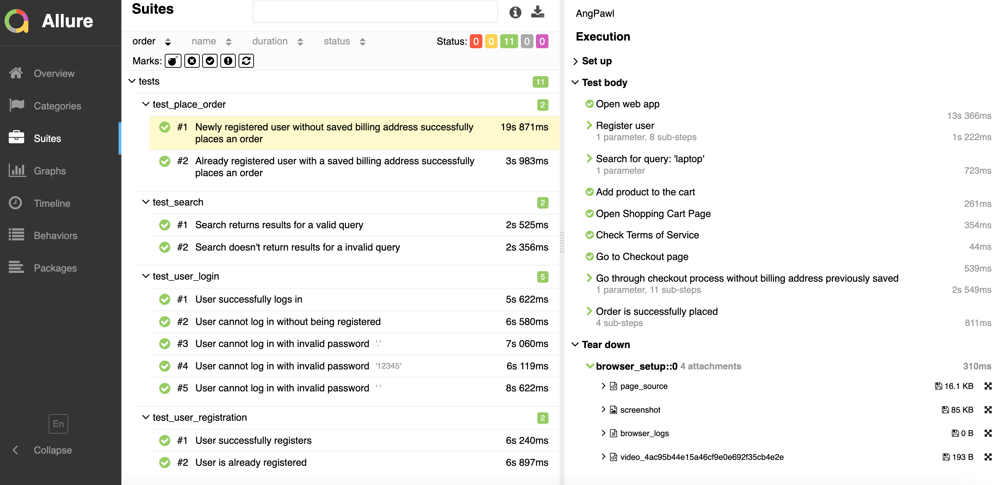

## General test run statistics, including manual tests, are stored on <a target="_blank" href="https://allure.autotests.cloud/project/3790/dashboards">Allure TestOps</a> platform

### *Main Allure TestOps dashboard:*

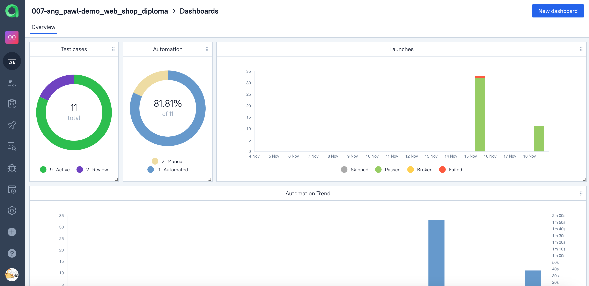

### *Full list of automated and manual test cases:*

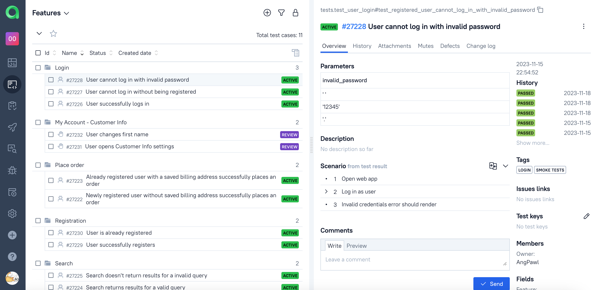

### *Automated and manual tests launch logs:*

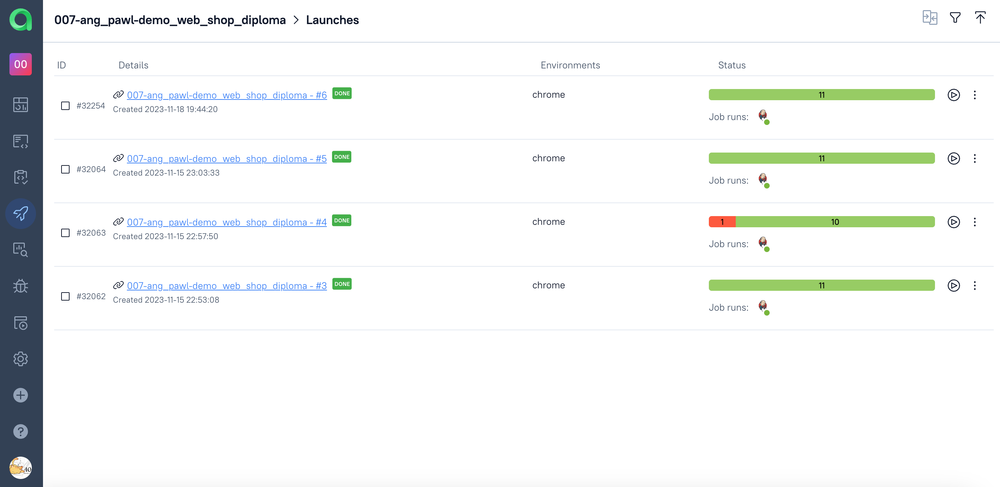

## Test cases and run results are integrated with <a target="_blank" href="https://jira.autotests.cloud/browse/HOMEWORK-959">Atlassian Jira</a> and linked to the corresponding task

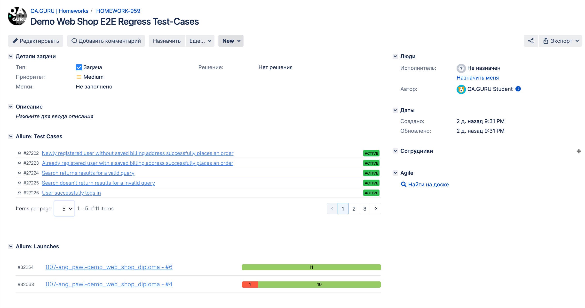

### Additionally, Telegram integration is set for immediate test result notifications:
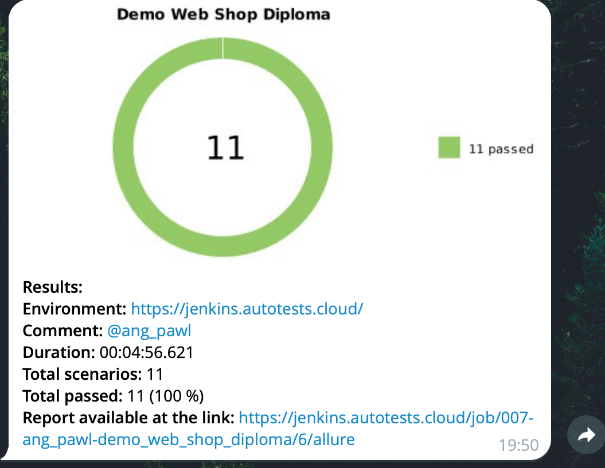

### There is a short video sample of a test case run from <a target="_blank" href="https://selenoid.autotests.cloud/#/">Selenoid</a> server
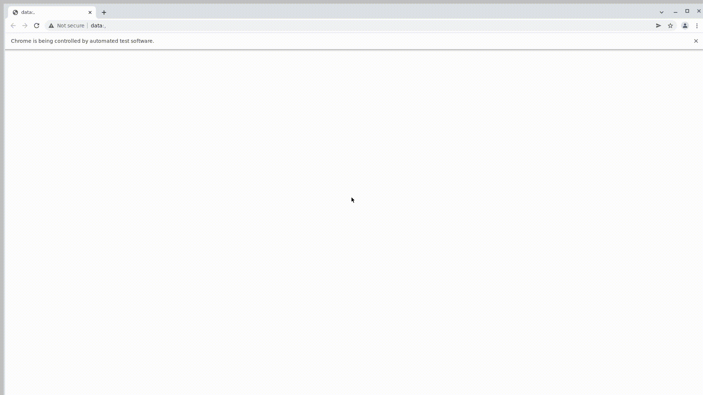

